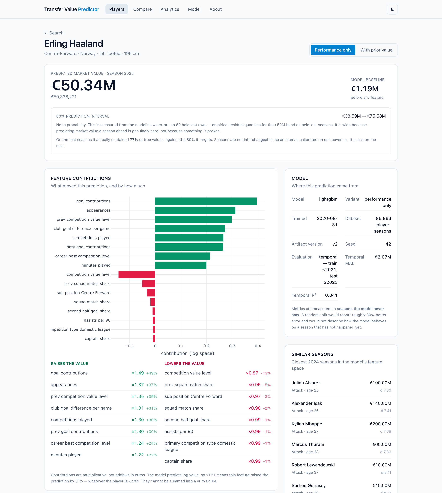
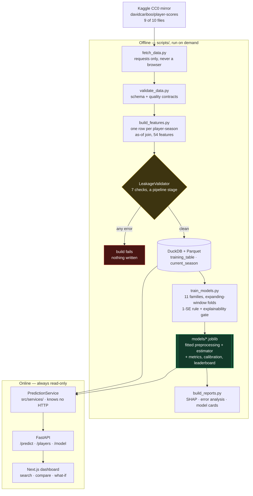
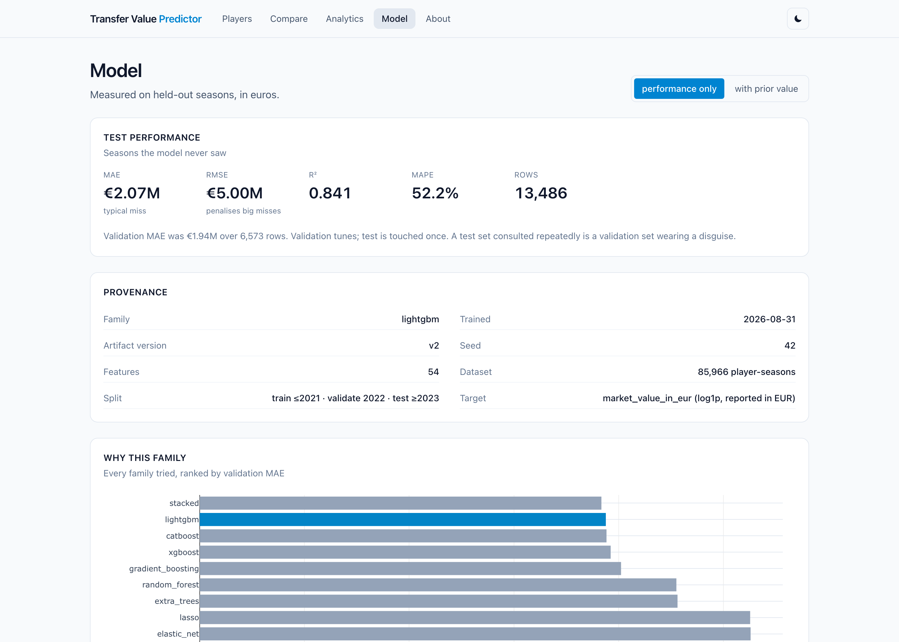
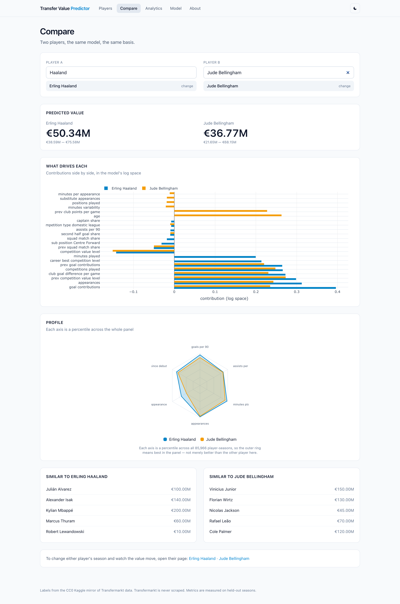

# Transfer Value Predictor

[](https://github.com/Vanshcloud/Transfer-Value-Predictor/actions/workflows/ci.yml)
[](https://www.python.org/downloads/)
[](#testing)
[](#testing)
[](LICENSE)
[](docs/DATASET_CARD.md)
[](https://github.com/psf/black)
[](https://mypy-lang.org/)

Predict the market value (EUR) of professional footballers from performance,
biographical and contextual data — and explain every prediction.

Search a player, get a valuation with a confidence interval, see the SHAP
contributions that produced it, compare him to the seasons nearest him in the
model's own feature space — then change the inputs and watch the number move.

Metrics are reported on **held-out seasons the model has never seen**: test MAE
**€2.07M** (R² 0.841) for the scouting model, **€1.64M** (R² 0.914) with a prior
valuation. A random split would read better and answer a question nobody
deploying this will ever ask.

**Try it without signing up for anything:** `make setup && make test` runs the
suite against the committed sample data — no Kaggle account, no download, no
trained model. Roughly fifteen seconds.



*Every prediction arrives with the interval it earned, the features that moved
it — read multiplicatively, because the model predicts log value — and the model
that produced it.*

## Why this repository looks the way it does

The architecture was decided *after* examining the data, not before. Three
findings shaped it, all recorded with evidence in
[`plans/00-discovery.md`](plans/00-discovery.md):

- **Transfermarkt is never scraped.** Its Terms of Use §11.1 prohibit automated
  access *and* separately prohibit using the content to train machine-learning
  models. Labels come from the CC0-licensed Kaggle mirror
  `davidcariboo/player-scores` instead.
- **There is no entity-resolution problem.** `appearances.csv` ships in the same
  CC0 download as the labels and shares its `player_id`, so features and labels
  join on an integer key. FBref was spiked as optional enrichment and declined —
  it is 403-Cloudflared to `requests`, reachable only via banned Selenium, and
  the columns it returns duplicate `appearances.csv` on a worse (name-based) key
  ([`plans/02-fbref-spike.md`](plans/02-fbref-spike.md)).
- **Temporal evaluation is the headline.** A measured spike
  ([`plans/01-feasibility-spike.md`](plans/01-feasibility-spike.md)) put EUR MAE
  at €2.37M under a group split and €3.96M under a temporal one. The temporal
  number is the one that reflects deployment, so it is the one reported.

## Setup

```bash
make setup
```

**macOS prerequisite.** LightGBM and XGBoost both link `@rpath/libomp.dylib` and
bundle no copy of it, so without this they fail at import with
`OSError: dlopen ... Library not loaded`:

```bash
brew install libomp
```

scikit-learn bundles its own OpenMP, which is why "sklearn works but LightGBM
doesn't" is such a common and confusing report. On Linux and in Docker the
manylinux wheels bundle libgomp and no action is needed.

## Architecture



Three properties this shape is chosen to guarantee:

- **The leakage stage can stop a build.** It is a pipeline stage, not a test,
  because a leak does not raise an exception — it produces a *better* number,
  and nobody investigates a model that beat expectations.
- **Preprocessing travels inside the artifact.** The fitted `ColumnTransformer`
  and the estimator serialise as one object, so training and serving cannot
  drift apart.
- **`src/` never imports `api/`.** The prediction service knows nothing about
  HTTP, which is why a batch job and the dashboard run identical code. CI
  enforces the direction rather than trusting it.

Full directory map and the reasoning behind each boundary:
[`PROJECT_STRUCTURE.md`](PROJECT_STRUCTURE.md).

## Pipeline

**First, data access.** `fetch_data.py` downloads the CC0 Kaggle mirror
`davidcariboo/player-scores`, which needs a free Kaggle account. Create a token
at [kaggle.com/settings](https://www.kaggle.com/settings), then either:

```bash
cp .env.example .env        # fill in KAGGLE_USERNAME and KAGGLE_KEY
```

or place the downloaded `kaggle.json` at `~/.kaggle/kaggle.json`. Without one of
those, `fetch_data.py` stops with a message naming both options rather than
failing obscurely.

**You do not need an account to run the project.** `data/sample/` is committed,
so `make test` gives you 679 passing tests and 53 skips with no credentials at
all — the 53 are the integration tests that need the full panel. `make test`
deselects them by marker; a bare `pytest` on that same clone *skips* them and
still reports zero failures, which is the stronger property and the one CI
checks. Only the three pipeline commands below need the
download.

Each stage reads what the last one wrote. Every figure in this README is
printed by a command below it, so nothing here is a number someone typed in.

```bash
python scripts/fetch_data.py       # Kaggle -> data/raw -> data/processed (parquet)
python scripts/validate_data.py    # contract checks; --strict fails on warnings too
python scripts/build_features.py   # one row per player-season, labelled and leak-checked
python scripts/train_baseline.py   # baselines across all three splits
python scripts/train_models.py     # eleven tuned families, best saved per variant
python scripts/build_reports.py    # evaluation, SHAP, error analysis, model cards
```

**The training table**

| Metric | Value |
|--------|-------|
| Rows | 85,966 player-seasons |
| Players | 24,411 |
| Seasons | 2011–2024 |
| Features | 54 |
| Rows with prior-season value | 61,522 |
| Current-season predictions | 8,709 |
| Confirmed data leakage | 0 |

> Data leakage was assessed through six independent audit phases; no confirmed
> leakage remained in the final dataset.

Two variants come out of the one table: *performance-only* (every row, the
useful model for scouting) and *with prior value* (61,522 rows, the accurate
model for tracking). Shipping only the second would be technically true and
practically useless.

> How the label is built, the tolerance window, the join mechanics and how the
> table reached this size are in
> **[`docs/METHODOLOGY.md` §1](docs/METHODOLOGY.md#1-label-construction)**.

## What the model sees

54 features, from every file the Kaggle dataset ships. The project previously
downloaded three of its ten, which is why "no league strength" and "five
performance statistics" were listed as limitations of the data rather than of
the pipeline.

| Group | Features |
|---|---|
| **Match output** | appearances, minutes, goals, assists, yellow/red cards, goal contributions |
| **Rates** | goals/90, assists/90, cards/90, contributions/90, minutes per appearance |
| **Squad role** | starts, substitute appearances, start share, captain share, positions played |
| **Availability** | share of the club's matches played, months active |
| **Consistency** | full-match share, minutes variability, scoring-match share |
| **Trajectory** | second-half goal share |
| **Club context** | points per game, goal difference per game, league position |
| **Competition** | value level, tier rank, competitions played, continental minutes share, type, confederation |
| **Biography** | age, age², height, position, sub-position, foot, citizenship |
| **Career stage** | years since debut, seasons observed |
| **Career momentum** | last season's minutes, appearances, contributions, start share, competition level, club form and squad share; the gap in seasons; season-over-season deltas; expanding career means and maxima |
| **Prior value** *(second variant only)* | lagged log value, its staleness in days |

Three of them needed care rather than code, and each is a leakage story:
`competition_value_level` is a target encoding built on a strictly expanding
window; club strength is joined **as of each row's own date** rather than
averaged over a season, which is where a label leak affecting 1,049 rows was
found and fixed; and career momentum is lagged *features*, never a lagged
label, worth −6.4% MAE (t = 11.30).

> Full reasoning for all three in
> **[`docs/METHODOLOGY.md` §2](docs/METHODOLOGY.md#2-the-three-features-that-needed-care-rather-than-code)**.

## Baselines

Before any tuning, gradient boosting scores **R² 0.770 / MAE €2.31M**
(performance-only) and **R² 0.899 / MAE €1.71M** (with prior value) on the
temporal split. A random split reads about 30% better and answers a question
nobody deploying this will ever ask, which is why the temporal number is the
one reported everywhere in this README.

> The three-way split comparison and the reproducibility guarantees are in
> **[`docs/METHODOLOGY.md` §3](docs/METHODOLOGY.md#3-baselines-and-why-the-temporal-split-is-the-headline)**.

## The model zoo

Eleven families (Linear, Ridge, Lasso, ElasticNet, RandomForest, ExtraTrees,
HistGradientBoosting, XGBoost, LightGBM, CatBoost, and a ridge-blended stack of
the three boosters), each searched on expanding-window folds inside the training
seasons, then scored once on the test seasons. LightGBM ships for both variants.

| Variant | Winner | Test MAE | Test R² | vs. baseline |
|---|---|---|---|---|
| performance-only | LightGBM | €2.07M ± 0.04M | 0.841 | 0.770 |
| with prior value | LightGBM | €1.64M ± 0.04M | 0.914 | 0.899 |



*`/model` shows the winner's held-out metrics, its full provenance, and the
families it beat — with the spread between them stated rather than hidden.*

**Selection is not `min()`.** Two rules decide what ships: the model must be
able to explain a prediction, and among families within one standard error of
the best, the cheapest to deploy wins (Breiman, Friedman, Olshen & Stone, 1984).
The stacked blend scores lowest on both variants and exposes no feature
importances at all, so it does not ship — a constraint that now costs €10,152 of
validation MAE at **p = 0.32**, which is to say nothing measurable.

Each run writes a versioned artifact to `models/` — the fitted preprocessing
and estimator as one object, plus metrics, named feature importance, the full
leaderboard and the seed. A test asserts a reloaded artifact reproduces its
recorded metrics exactly.

> Why the top four families are statistically indistinguishable, what the
> explainability constraint excludes and why deployment footprint is the
> tiebreak: **[`docs/METHODOLOGY.md` §4](docs/METHODOLOGY.md#4-model-selection)**.
> The artifact contract is
> [`docs/EXPERIMENT_TRACKING.md`](docs/EXPERIMENT_TRACKING.md).

## Evaluation and explanations

`scripts/build_reports.py` reads the saved models — it trains nothing — and
writes self-contained HTML into `reports/`, plus a model card per variant and
[`docs/model_comparison.md`](docs/model_comparison.md), which shows *why*
LightGBM was selected rather than just that it was. The data those models are
fitted to has its own card,
[`docs/DATASET_CARD.md`](docs/DATASET_CARD.md) — hand-written rather than
generated, because most of what matters there is why a column is *absent*, and
an absent column cannot generate its own explanation.

| | |
|---|---|
| `reports/baseline_report.html` | every family, accuracy beside training time, prediction time and model size |
| `reports/evaluation.html` | test metrics, predicted-vs-actual, residuals |
| `reports/feature_importance.html` | what the fitted model leans on |
| `reports/shap_summary.html` | global impact plus worked per-player waterfalls |
| `reports/error_analysis.html` | error by value band, age, position and season |

Two things the cost columns showed that accuracy alone would not: Random Forest
serialises to **458 MB** against LightGBM's 1.7 MB while scoring worse, and
CatBoost is within **0.75%** of the winner for 5.7× faster training and 4.8×
less disk — so if serving cost ever matters, that is the switch to make.

**Explanations are data, not pictures.** `src/explainability/` returns
dataclasses and floats and imports no plotting library, because Phase 9's
`POST /predict` has to return contributions as JSON and Phase 10 has to draw
them in a browser. The HTML is a rendering layer on top of the same functions.

SHAP values are additive in **log space**, since the models fit `log1p(EUR)`.
They are *not* additive in euros — the same contribution is worth a different
number of euros for a €500k player and a €90M one — so each one also carries
an exact multiplicative reading (`effect_multiplier`), which is the honest unit
for a log-target model and the one the API surfaces.

## API

```bash
make serve        # uvicorn api.main:app --reload
```

Interactive docs at `/docs`, the schema at `/api/v1/openapi.json`. The contract
is written down first, in [`docs/API_CONTRACT.md`](docs/API_CONTRACT.md), and
the service conforms to it — where the two disagree, the document is the defect
report.

All eleven, in full — a table that lists nine of eleven is worse than no table,
because a reader trusts it:

| Method | Path | What it answers |
|---|---|---|
| `GET` | `/health` | Alive, and can it predict? Unversioned, for orchestrators. |
| `POST` | `/api/v1/predict` | What is this player worth, and why? |
| `GET` | `/api/v1/players` | Which players match this name? |
| `GET` | `/api/v1/players/{player_id}` | Every season on file, plus a what-if seed. |
| `GET` | `/api/v1/players/{player_id}/similar` | Whose season most resembles this one? |
| `GET` | `/api/v1/players/{player_id}/history` | Predicted against actual, season by season. |
| `GET` | `/api/v1/features/distribution` | Where does a value sit in the population? |
| `GET` | `/api/v1/models` | Which variants are loaded? |
| `GET` | `/api/v1/models/{variant}` | Family, params, features, training data. |
| `GET` | `/api/v1/models/{variant}/metrics` | Held-out metrics, in EUR. |
| `GET` | `/api/v1/models/{variant}/feature-importance` | What the model leans on, and global SHAP. |

`tests/unit/test_api_contract_sync.py` diffs this table, `docs/API_CONTRACT.md`
and the live OpenAPI document against each other in every direction. The audit
that prompted it found two endpoints served for a week that the contract had
never heard of, then found the same two missing from this table after the
contract was fixed — a document nothing checks is checked once, on the day it
is written.

`POST /api/v1/predict` takes **either** a `player_id` **or** an explicit
`features` map — never both, never neither. Unknown feature names are rejected
rather than dropped, because silently ignoring a misspelt `minutes_playd`
returns a confident answer to a question nobody asked. Feature *values* are
checked too: a non-number, a non-finite number, a negative goal count or an
object where a scalar belongs comes back as a `422` naming the offending
feature, not as a `500`.

**On `confidence`.** A gradient booster has no calibrated uncertainty, and this
API will not invent one. The `confidence` field is an *empirical prediction
interval*: the model's own residual quantiles, measured on held-out seasons,
for the value band the prediction falls into, with the row count it was
measured over. `level: 0.8` means 80% of held-out predictions in that band
landed inside those bounds. The intervals are wide — roughly ×0.35 to ×5.0.
That is the honest finding, not a defect to tune away.

**Layering.** `src/services/prediction.py` imports no web framework — a test
asserts it, against parsed imports rather than a grep. That is what lets the
same prediction path serve HTTP, a batch job or a CLI, and why the 92 tests for
prediction logic need no running server.

## Dashboard

```bash
make serve                          # API on :8000
cd frontend && npm ci && npm run dev # dashboard on :3000
```

Next.js 16, React 19, Tailwind v4, Plotly. The flow is the product: search a
player, get a prediction with its interval, see what drove it, see comparable
seasons, then **change the inputs and watch the value move**.

| Page | What it answers |
|---|---|
| `/players` | Which player? Modellable ones first. |
| `/players/[id]` | What is he worth, why, next to whom — and what if? |
| `/compare` | How do two players differ, and on what? |
| `/analytics` | How is value distributed across the panel? |
| `/model` | How good is this model, and why was it chosen? |
| `/about` | Where the data came from and where not to trust it. |



*`/compare` puts two players through the same model on the same basis —
contributions side by side, then a percentile radar across the whole panel.*

Every prediction is shown beside the model that produced it — family, training
date, dataset size, artifact version, and the **temporal** MAE and R². A number
with no attribution invites more trust than it has earned.

```bash
cd frontend && npm test        # 77 tests, ~2s
```

The suite covers the places where being wrong is *silent* — error mapping, the
race guard that stops a stale response overwriting a fresh one, and the rule
that a per-feature euro figure never appears beside a SHAP contribution because
that number would be false. Charts render an accessible table alongside the
SVG, since the numbers are the content.

> Frontend testing strategy, accessibility mechanics and the three build traps
> (Plotly SSR, bundle size, Tailwind v4 being CSS-first) are in
> **[`frontend/README.md`](frontend/README.md)**.

## Running it in containers

```bash
docker compose up --build       # API on :8000, dashboard on :3000
```

The API image installs `requirements-serve-lock.txt`, not the full stack: the
zoo trains nine families and serving loads one, and the difference is 291 MB of
CUDA libraries that xgboost brings for a GPU this inference path never touches,
plus 269 MB of catboost and its plotly. Dropping both took the image from
**2.62 GB to 1.32 GB** with an identical prediction on the same input. The
trade is stated in `requirements-serve.txt` and guarded by
`tests/integration/test_serving_dependencies.py`, which fails if a tuning run
ever ships an artifact the serving image cannot unpickle. `scripts/` is left
out of that image for the same reason — commands that would raise ImportError
are worse than commands that are absent.

The images deliberately **do not contain the data or the models**. The parquet
panel is hundreds of megabytes and refreshes weekly; the models are regenerated
by `scripts/train_models.py`. An image with either baked in is stale the day it
is built, so compose mounts `data/processed/` and `models/` read-only instead.
Run the three pipeline commands above at least once before `docker compose up`,
or the API starts *degraded*: `/health` returns 200 and reports
`ready: false`, which is the honest answer for a process that is alive but has
nothing to serve.

`NEXT_PUBLIC_API_BASE` is baked into the dashboard at **build** time, not run
time — Next inlines `NEXT_PUBLIC_*` into the client bundle. A deployment
pointing at a different API rebuilds the image. That is the real consequence of
shipping a URL to the browser, so it is stated rather than hidden behind a
runtime variable that would not work.

Postgres is not in the compose file. The storage layer sits behind a Protocol
(`src/storage/base.py`), so adding it later is a second implementation rather
than a rewrite — and running a database nothing reads from yet would be a
service to maintain for no measured benefit.

## CI

[`.github/workflows/ci.yml`](.github/workflows/ci.yml) runs four jobs on every
push and pull request:

- **Backend** — ruff, black, mypy, and the unit suite.
- **Dashboard** — tsc, eslint, and `next build`, the step that catches the
  Plotly SSR trap.
- **Authorship** — no `Co-Authored-By` trailers, no AI attribution lines.
- **Removed APIs** — greps for APIs that were deleted from dependencies this
  project pins, plus two architectural boundaries: `duckdb` may only be
  imported inside `src/storage/`, and Plotly only inside `Chart.tsx`.

CI runs on a clean checkout, where `data/` and `models/` are empty. Every test
that needs them **skips** rather than fails — verified on a fresh clone: 679
pass, the 53 integration tests skip, nothing fails. A suite that is only green on a machine with a trained
model is not a suite anyone can trust.

## Development

```bash
make help          # list every target
make test          # unit tests
make quality       # ruff + black --check + mypy
```

Python 3.13. Dependencies are declared as reasoned ranges in
`requirements.txt` and pinned exactly — all 55 packages, transitives included —
in `requirements-lock.txt`, which is what CI, Docker and `make setup` install.
`tests/unit/test_dependencies.py` fails if the two ever disagree.

> Why the bounds are where they are, and how to regenerate either lock, is in
> **[`CONTRIBUTING.md`](CONTRIBUTING.md)**.

## Testing

```bash
make test        # 679 pass, 53 skip — no data, no credentials, ~15s
make test-cov    # the same suite with coverage, fails under 88%
pytest           # everything; integration tests run if data and models exist
```

**732 tests, 90% coverage.** The split matters more than the count:

| Suite | Files | Needs | Behaviour without data |
|---|---|---|---|
| `tests/unit/` | 31 | nothing | runs — against committed `data/sample/` |
| `tests/integration/` | 7 | Kaggle download + a trained model | **skips**, never fails |

Integration tests skipping rather than failing is deliberate. A suite that is
only green on the machine that trained the model is not a suite, and CI checks
the stronger property: on a clean clone with no data at all, `pytest` reports
zero failures.

Three kinds of test earn their place beyond the usual:

- **Leakage tests that construct the leak.** `tests/unit/test_context.py`
  builds a club that plays a fixture after the row's as-of date and asserts it
  cannot reach the features. A test that would still pass with the guard
  deleted is not testing the guard.
- **Documented-number tests.** `tests/unit/test_documented_numbers.py` runs
  pytest's own collector in a subprocess and fails if the README's test counts
  or coverage claims have drifted. Prose does not recompute; this compares it.
- **Population assertions.** `TestNothingImportantIsSilentlyEmpty` asserts that
  the number of servable players *equals* the number of labelled players. Two
  high-severity bugs survived four audits by returning `200` with an empty
  list, and every single-player test passed throughout.

## Contributors

This project has a single author, Vansh Tomar. `scripts/hooks/commit-msg`
enforces it: commits carrying a `Co-Authored-By` trailer or an AI-generation
marker are rejected, as are commits authored by anyone else. The hook is
version-controlled and wired via `core.hooksPath`, so it survives a reclone.

## What this still cannot do

Stated because a model whose limits are not written down is a model whose
limits are discovered by whoever trusts it first. Each was **measured**, not
assumed — the working is in
[`docs/METHODOLOGY.md` §5](docs/METHODOLOGY.md#5-limitations-in-full).

- **Coverage begins in 2012.** Extending it is possible and pointless: the
  40,339 reconstructable pre-2012 rows were built and added, and moved held-out
  MAE by 0.19% (**p = 0.73**), because only 7 of 54 features exist on such a row.
- **The labels are community estimates, not prices anyone paid.** Four
  alternative targets — transfer fee, delta value, within-season percentile,
  career peak — were each measured and none is better.
- **Error grows with value.** The target spans four orders of magnitude, so a
  mid-table MAE conceals larger absolute misses at the top of the market. Read
  the per-band breakdown in `reports/error_analysis.html`.
- **Prediction intervals are wide, and cover slightly less than they say** —
  a measured **0.77** against a nominal 0.80. Every response carries
  `measured_coverage` beside `level`. Conformalised quantile regression, split
  conformal and raw quantile regression were all measured and all lose on
  Winkler score to the method already here.
- **The best model does not ship**, because it cannot explain a prediction.
  That now costs €10,152 at p = 0.32. Knowledge distillation was tested as an
  alternative and rejected: against a *regularised* LightGBM the student is
  worth €2,487 (p = 0.72).
- **Seasons are August to July, and no single boundary is right for every
  league.** An alternative index was built and measured *worse*; the apparent
  10% win was the forecast horizon collapsing from 141 days to 23.

## What an adversarial audit found

The project has been audited six times. The fifth pass was told not to improve
anything and to try to break it instead, and found two high-severity bugs that
four previous passes had missed — both returning an empty list rather than an
error, which is why nothing caught them:

- **Comparables were dead for every active player** — 32.8% of the panel.
- **59% of players had an empty career chart**, because the service required
  all 54 features to be non-null in a pipeline that carries a fitted imputer.

Neither was a modelling error and neither showed in a metric. Both are fixed
and both have regression tests. The pattern is worth stating: *an empty result
is not a safe failure mode.* The metrics in this README were never wrong; the
dashboard was quietly showing a third of its users nothing.

The sixth pass looked at engineering rather than science and found the largest
defect in the serving path: **`POST /predict` spent 97% of its time rebuilding
a SHAP explainer** for a model that never changes. Caching it took the endpoint
from **385 ms to 30 ms** with bit-identical output.

| Endpoint | p50 |
|---|---|
| `GET /players/{id}` | 2.8 ms |
| `GET /players/{id}/history` | 8.9 ms |
| `GET /players/{id}/similar` | 10.0 ms |
| `GET /players?q=` | 14.2 ms |
| `POST /predict` (with SHAP explanation) | 29.8 ms |

Startup is 1.27 s including both models, 86k player-seasons and 50k names; RSS
settles around 660 MB.

> Both audits in full, with the measurements behind every figure:
> **[`plans/07-adversarial-audit.md`](plans/07-adversarial-audit.md)** and
> **[`plans/08-staff-engineering-pass.md`](plans/08-staff-engineering-pass.md)**.

## How it was built

Thirteen phases, each leaving the repository runnable, green and committed. The
plan and the decisions that changed on contact with the data are in
[`plans/IMPLEMENTATION_PLAN.md`](plans/IMPLEMENTATION_PLAN.md). Two are worth
reading on their own: the optional FBref enrichment was spiked and **declined on
measured evidence** ([`plans/02-fbref-spike.md`](plans/02-fbref-spike.md)), and
the release audit is recorded with its findings in
[`plans/03-final-verification.md`](plans/03-final-verification.md).

Backend test coverage, with the command that prints each number:

| | Coverage | Tests |
|---|---|---|
| `make test-cov` — no credentials, no data | **90%** | 679 pass, 53 deselected |
| `make test-cov-all` — needs the Kaggle download and a trained model | **97%** | 732 pass |

The gap is the pipeline orchestration in `src/pipelines/`, which is what the
integration tests exercise. Both targets fail below their floor, so neither
number can drift without CI going red. The frontend is covered separately by
`cd frontend && npm test` (see [Dashboard](#dashboard)).

## Future work

Everything below is open because a measurement says so; the ideas that were
built, measured and rejected are in [`plans/`](plans/) and are deliberately not
listed as future work. Full reasoning in [`ROADMAP.md`](ROADMAP.md).

- **Report the repeated-season protocol as the headline.** Selection uses one
  validation season. Every *comparison* in phases 16–18 already used expanding
  windows over 2018–2022 at three seeds with paired testing; the *result*
  should be reported the same way. Costs roughly 30× the training time.
- **Compare against a published baseline.** "Good" is currently established
  against this project's own earlier selves. Blocked on finding published work
  evaluated on a comparable panel with a temporal split — most uses random
  splits, which is not a fair comparison in either direction.
- **Anchor the label per competition without moving the horizon.** The
  August–July index costs measurable accuracy on the 19.6% of player-seasons
  that straddle it, and the obvious fix was built and measured *worse*. Blocked
  on a per-competition calendar table this dataset does not contain.
- **Export to a format that cannot execute.** ONNX would remove the
  unpickling assumption in [`SECURITY.md`](SECURITY.md), at the cost of the
  fitted preprocessing travelling inside the artifact — a deliberate trade, not
  a pending fix.

## Citations

If you use this repository, cite the dataset as well as the code — the labels
are somebody else's work.

```bibtex
@software{tomar_transfer_value_predictor,
  author  = {Tomar, Vansh},
  title   = {Transfer Value Predictor: explainable market-value estimation
             for professional footballers},
  year    = {2026},
  url     = {https://github.com/Vanshcloud/Transfer-Value-Predictor},
  license = {MIT}
}

@misc{cariboo_player_scores,
  author       = {Cariboo, David},
  title        = {Football Data from Transfermarkt},
  howpublished = {Kaggle dataset \texttt{davidcariboo/player-scores}},
  note         = {CC0 1.0 Universal},
  url          = {https://www.kaggle.com/datasets/davidcariboo/player-scores}
}
```

Methods this project leans on directly:

- Breiman, Friedman, Olshen and Stone (1984), *Classification and Regression
  Trees* — the one-standard-error rule, which is what stops model selection
  reading a third decimal as a result.
- Lundberg and Lee (2017), *A Unified Approach to Interpreting Model
  Predictions* — SHAP, used for every explanation served.
- Romano, Patterson and Candès (2019), *Conformalized Quantile Regression* —
  evaluated against the shipped interval method and measured worse on Winkler
  score here, which is why it is not used.

## Acknowledgements

- **David Cariboo**, for maintaining the CC0 mirror that makes this project
  legally possible at all.
- **Transfermarkt's contributor community**, whose valuations are the labels.
  The model reproduces their consensus, including wherever it is biased — it
  does not independently observe what anyone would pay.
- The maintainers of **scikit-learn, LightGBM, XGBoost, CatBoost, SHAP,
  FastAPI, pandas and Next.js**, all of which are load-bearing here.

## Licence

MIT — full text in [`LICENSE`](LICENSE).

The data carries its own terms and they are not MIT. Labels and appearances come
from `davidcariboo/player-scores`, which is CC0. Transfermarkt's own Terms of Use
§11.1 prohibit both automated access and ML training on the content, which is why
nothing here fetches it.

---

**Further reading.** [`docs/METHODOLOGY.md`](docs/METHODOLOGY.md) ·
[`PROJECT_STRUCTURE.md`](PROJECT_STRUCTURE.md) ·
[`docs/DATASET_CARD.md`](docs/DATASET_CARD.md) ·
[`docs/MODEL_CARD_performance_only.md`](docs/MODEL_CARD_performance_only.md) ·
[`docs/API_CONTRACT.md`](docs/API_CONTRACT.md) ·
[`docs/demo_script.md`](docs/demo_script.md) ·
[`ROADMAP.md`](ROADMAP.md) · [`SECURITY.md`](SECURITY.md) ·
[`CONTRIBUTING.md`](CONTRIBUTING.md) · [`plans/`](plans/)
